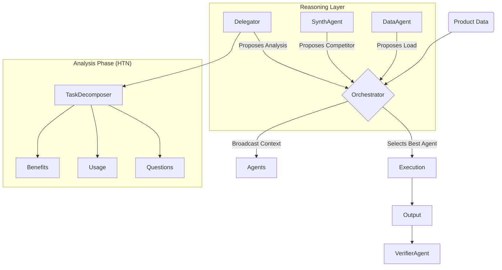

# System Design Document

**Project**: Kasparro Applied AI Engineer Assignment
**Author**: Sarvagya Jain

## 1. Problem Statement
The goal is to automate the creation of high-quality, structured skincare product content (FAQs, descriptions, comparison pages) at scale. Manual creation is slow, inconsistent, and error-prone. We need a system that is:
*   **Autonomous**: Operates with minimal human intervention.
*   **Dynamic**: Adapts to missing data (e.g., generating comparisons on the fly).
*   **Safe**: Adheres to strict safety and brand guidelines.

## 2. Solution Overview
We implemented a **Multi-Agent System (MAS)** based on the **Coordinator-Worker-Delegator (CWD)** pattern, enhanced with **Dynamic Orchestration**.

### 2.1 Core Innovations
Unlike rigid pipelines, this system uses:
1.  **Proposal-Based Orchestration**: Agents bid for work based on their confidence in handling the current context.
2.  **HTN Planning**: The 'Manager' (Delegator) decomposes high-level goals into dependency graphs, allowing flexible execution order.
3.  **Circuit Breakers**: Automated safety stops if failure rates spike.

## 3. Architecture

### 3.1 High-Level Flow


### 3.2 Data Flow
1.  **Ingestion**: Raw JSON loaded by `DataAgent`.
2.  **Augmentation**: `SyntheticDataAgent` creates competitor data if missing.
3.  **Analysis**: `Delegator` runs workers to extract benefits, usage, and generate FAQs (via LLM).
4.  **Generation**: `GenerationAgent` maps analyzed data to Jinja2 templates.
5.  **Output**: Final JSON files (`faq.json`, `product_page.json`, `comparison_page.json`).

## 4. Key Mechanisms

### 4.1 Orchestrator Loop
The `Orchestrator` runs a continuous loop:
```python
while not complete:
    proposals = [agent.propose(context) for agent in agents]
    best_agent = select_best(proposals)
    best_agent.run()
```
This ensures the system is never "stuck" in a script—it always reacts to the current state.

### 4.2 Handling Ambiguity
If data is missing, the proper agent (`DataAgent` or `SyntheticDataAgent`) naturally proposes to fix it with high confidence, "healing" the context before downstream agents act.

## 5. Security & Safety
*   **InjectionDefense**: Scans all inputs for 12+ attack patterns.
*   **Refusal**: Agents will refuse to process valid commands if safety checks fail.
*   **Traceability**: Every decision is logged in `traces/` for audit.

## 6. Assumptions
*   Input data is provided in JSON format.
*   The system runs in a local environment (optionally connected to LLM APIs).
*   Mock mode is available for offline testing.
