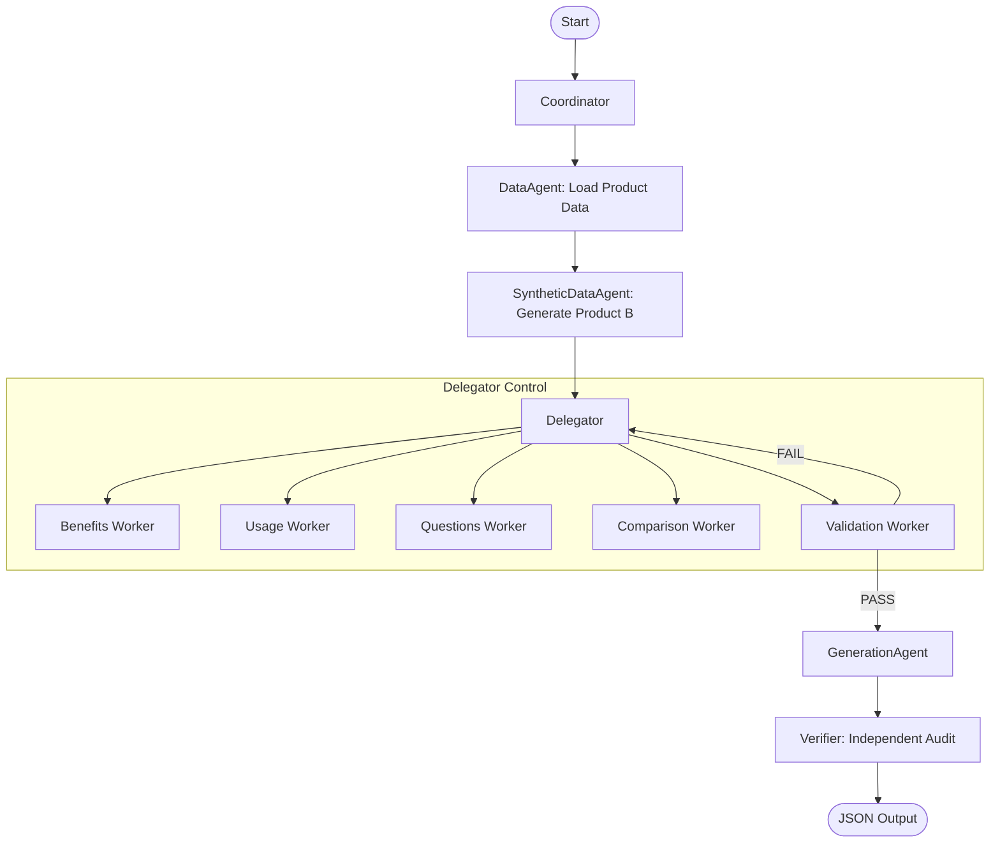
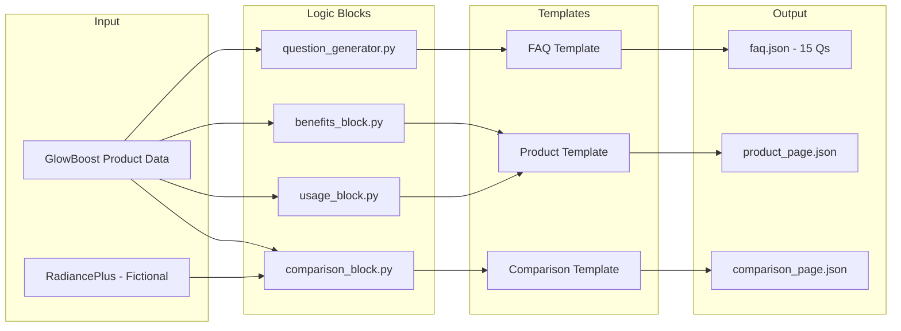

# Kasparro Multi-Agent Content Generation System

## Problem Statement

### The Challenge: Automating Skincare Content at Scale

In e-commerce, creating high-quality, consistent product content is resource-intensive:
- **Volume**: Thousands of products require FAQs, descriptions, and comparisons
- **Consistency**: Maintaining accuracy across all content
- **Scalability**: Manual creation costs $50-100 per product page

**Our Solution:** A multi-agent AI system using the **Coordinator-Worker-Delegator (CWD)** architecture that generates consistent, structured content autonomously.

---

## Solution Overview

### Coordinator-Worker-Delegator (CWD) Architecture

```
┌─────────────────────────────────────────────────────────────┐
│                      COORDINATOR                            │
│  (orchestrator.py - State/Memory Management)               │
└─────────────────────────────────────────────────────────────┘
                           │
        ┌──────────────────┼──────────────────┐
        ▼                  ▼                  ▼
┌──────────────┐   ┌──────────────┐   ┌──────────────┐
│  DataAgent   │   │  Delegator   │   │  Generation  │
│  Synthetic   │   │   +Workers   │   │  +Verifier   │
└──────────────┘   └──────────────┘   └──────────────┘
```

**Key Components:**
| Component | File | Purpose |
|-----------|------|---------|
| Coordinator | `orchestrator.py` | Strategic routing, state/memory |
| Delegator | `delegator.py` | Task distribution with retry |
| Workers | `workers.py` | Specialized domain tasks |
| Verifier | `verifier.py` | Independent output verification |

---

## System Design

### Agent Flow Diagram



### Data Flow



---

## Scopes & Assumptions

### In Scope
- Parse GlowBoost product data (as specified in assignment)
- Generate 15+ categorized questions
- Create 3 JSON output files (FAQ, Product, Comparison)
- Fictional Product B (RadiancePlus) for comparison
- Autonomous multi-agent pipeline

### Assumptions
- No external API calls (mock/simulated LLM)
- Single product input per run
- English language only
- JSON output format

---

## Key Features

### 1. Safety & Verification
| Feature | File | Purpose |
|---------|------|---------|
| Guardrails | `guardrails.py` | Input/tool validation, PII detection |
| HITL Gate | `hitl.py` | Human authorization for high-stakes |
| VerifierAgent | `verifier.py` | Independent output audit |

### 2. State & Memory
| Feature | File | Purpose |
|---------|------|---------|
| StateSpace | `state_manager.py` | Workflow phases, transitions |
| Working Memory | `memory.py` | Short-term task context |
| Episodic Memory | `memory.py` | Past outcomes for learning |
| Knowledge Base | `memory.py` | Persistent domain rules |

### 3. Evaluation & Observability
| Feature | File | Purpose |
|---------|------|---------|
| Failure Taxonomy | `evaluation.py` | Categorize failures |
| Execution Tracer | `tracer.py` | Log agent calls, export traces |

### 4. Tooling
| Feature | File | Purpose |
|---------|------|---------|
| Role-Based Access | `tools/__init__.py` | Limit tools per agent |
| Graceful Errors | `tools/__init__.py` | Descriptive error messages |

---

## Agent Personas (Role Engineering)

| Agent | Role | Backstory |
|-------|------|-----------|
| Coordinator | Strategic Director | Ensures system integrity, optimizes flow |
| Delegator | Project Manager | Distributes tasks, tracks completion |
| BenefitsWorker | Benefits Specialist | Dermatologist assistant for benefits |
| UsageWorker | Usage Specialist | Product usage guidelines expert |
| QuestionsWorker | FAQ Generator | Customer success specialist |
| ValidationWorker | QA Officer | Strict content auditor |
| VerifierAgent | Independent Auditor | "Never trusts, always verifies" |

---

## Output Files

### 1. faq.json (15 Questions)
```json
{
  "product": "GlowBoost Vitamin C Serum",
  "total_questions": 15,
  "faqs": [
    {"question": "...", "answer": "...", "category": "Informational"},
    ...
  ]
}
```

### 2. product_page.json
```json
{
  "product_info": {"name": "...", "brand": "...", "concentration": "..."},
  "benefits": [...],
  "ingredients": {...},
  "pricing": {"price": 699.0, "currency": "INR"}
}
```

### 3. comparison_page.json
```json
{
  "primary_product": "GlowBoost Vitamin C Serum",
  "comparison_with": "RadiancePlus Brightening Serum",
  "comparison_table": [...],
  "winner_categories": {...}
}
```

---

## Run Commands

```bash
# Main pipeline
python -m skincare_agent_system.main

# Run all tests
pytest tests/ -v

# Specific test suites
pytest tests/test_safety.py -v
pytest tests/test_memory.py -v
pytest tests/test_evaluation.py -v
pytest tests/test_tools.py -v
```

---

## Architecture Patterns

1. **CWD Model**: Coordinator-Worker-Delegator hierarchy
2. **Single Responsibility**: Each agent has one focused task
3. **State Machine**: Orchestrator uses StateSpace for routing
4. **Tool Autonomy**: Agents select tools via ToolRegistry
5. **Role Engineering**: Personas with role + backstory

---

## File Structure

```
skincare_agent_system/
├── main.py                 # Entry point
├── orchestrator.py         # Coordinator (state/memory)
├── delegator.py            # Task distribution + retry
├── workers.py              # Specialized workers
├── verifier.py             # Independent verification
├── agents.py               # BaseAgent class
├── models.py               # Pydantic models
├── guardrails.py           # Safety callbacks
├── hitl.py                 # Human-in-the-loop
├── state_manager.py        # StateSpace
├── memory.py               # Memory system
├── evaluation.py           # Failure analysis
├── tracer.py               # Execution tracing
├── tools/
│   ├── __init__.py         # ToolRegistry, role-based access
│   └── content_tools.py    # Content transformation tools
├── logic_blocks/
│   ├── benefits_block.py
│   ├── usage_block.py
│   ├── comparison_block.py
│   └── question_generator.py
├── templates/
│   ├── faq_template.py
│   ├── product_page_template.py
│   └── comparison_template.py
└── data/
    └── products.py         # GlowBoost + RadiancePlus
```

---

## Conclusion

This system demonstrates:
- ✅ **CWD Architecture**: Clear hierarchy and boundaries
- ✅ **Safety**: Guardrails, HITL, independent verification
- ✅ **State Management**: Structured state space with memory
- ✅ **Observability**: Failure taxonomy, execution tracing
- ✅ **Tooling Best Practices**: Role-based access, graceful errors
- ✅ **Role Engineering**: Agent personas with backstories

**Author:** Sarvagya Jain
**Assignment:** Kasparro Applied AI Engineer Challenge
