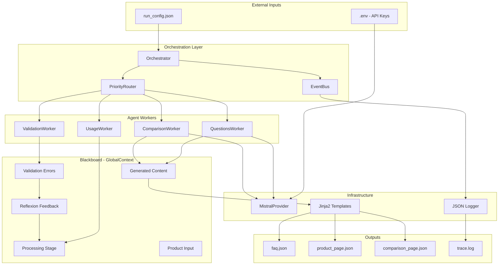
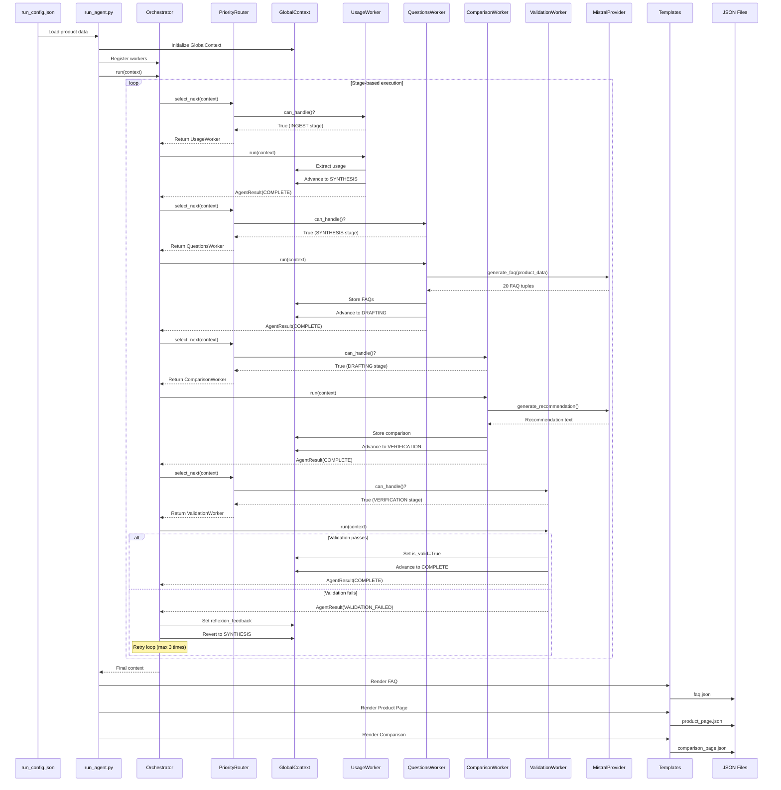
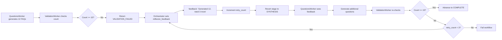

# Project Documentation: Kasparro Content Generation System

---

## Problem Statement

### Business Challenge

Skincare e-commerce platforms face a critical content scalability problem:

1. **Manual Content Creation**: Product pages, FAQs, and comparisons require significant human effort
2. **Inconsistent Quality**: Content varies in depth, accuracy, and structure across products
3. **Slow Time-to-Market**: New product launches delayed by content creation bottlenecks
4. **Maintenance Burden**: Updating content across multiple products is labor-intensive

### Technical Requirements

The solution must:
- Generate **structured, machine-readable content** (FAQ, product pages, comparisons)
- Ensure **≥15 FAQ questions** per product with proper categorization
- Support **autonomous operation** without manual intervention
- Provide **self-correction mechanisms** for quality assurance
- Enable **LLM integration** with graceful degradation
- Maintain **complete traceability** for debugging and auditing

---

## Solution Overview

### High-Level Approach

The Kasparro Content Generation System is an **autonomous multi-agent framework** that orchestrates specialized AI agents to generate skincare product content. Built on the **Blackboard architectural pattern**, the system enables agents to collaborate through a shared state while maintaining independence and modularity.

### Key Innovations

#### 1. Blackboard Architecture
Instead of complex message-passing between agents, all workers read from and write to a single `GlobalContext` (the "blackboard"). This simplifies coordination and provides a single source of truth.

#### 2. Stage-Based Routing
Agents activate based on processing stages (INGEST → SYNTHESIS → DRAFTING → VERIFICATION → COMPLETE) using simple boolean `can_handle()` logic, eliminating complex bidding systems.

#### 3. Reflexion Self-Correction
When validation fails (e.g., <15 FAQs generated), the orchestrator automatically:
- Sets feedback in the context
- Reverts to the appropriate stage
- Retries with amended instructions
- Limits retries to prevent infinite loops

#### 4. Provider Abstraction
LLM integration is abstracted through `IIntelligenceProvider`, allowing:
- Mistral AI for production-quality content
- Automatic retry with exponential backoff
- Circuit breaker pattern for graceful degradation

### System Capabilities

| Capability | Implementation |
|------------|---------------|
| **FAQ Generation** | LLM-powered generation of 20 categorized Q&A pairs |
| **Product Analysis** | Automated extraction of usage instructions and benefits |
| **Comparative Analysis** | Multi-product comparison with recommendations |
| **Quality Validation** | Schema validation + safety policy checks |
| **Self-Correction** | Reflexion loop with max 3 retries |
| **Observability** | JSON structured logging with trace IDs |

---

## Scopes & Assumptions

### In Scope

#### Content Generation
- ✅ FAQ page generation (20 questions, 5 categories)
- ✅ Product page with specifications and usage
- ✅ Product comparison with recommendations
- ✅ JSON structured output format

#### System Features
- ✅ Autonomous multi-agent orchestration
- ✅ LLM integration (Mistral AI)
- ✅ Self-correction via Reflexion
- ✅ Schema validation (Pydantic)
- ✅ Event-driven logging
- ✅ External configuration injection

#### Quality Assurance
- ✅ Minimum 15 FAQ questions enforced
- ✅ Safety policy validation
- ✅ Pydantic schema validation
- ✅ Comprehensive test coverage

### Out of Scope

#### Content Types
- ❌ Blog posts or long-form articles
- ❌ Social media content
- ❌ Email marketing copy
- ❌ Video scripts

#### Advanced Features
- ❌ Multi-language support
- ❌ Real-time content updates
- ❌ User personalization
- ❌ A/B testing framework
- ❌ Content performance analytics

#### Infrastructure
- ❌ Web UI for content management
- ❌ Database persistence
- ❌ API endpoints for external access
- ❌ Cloud deployment automation
- ❌ Horizontal scaling

### Assumptions

#### Technical Assumptions
1. **Python Environment**: Python 3.8+ available with pip
2. **API Access**: Mistral API accessible (optional, system works without it)
3. **File System**: Write access to `output/` directory
4. **Configuration**: Product data provided in valid JSON format
5. **Dependencies**: All packages in `requirements.txt` installable

#### Data Assumptions
1. **Product Data Quality**: Input data contains required fields (name, brand, ingredients)
2. **Comparison Products**: Comparison product is in same category as primary product
3. **Language**: All content generated in English
4. **Skin Types**: Limited to predefined set (Oily, Dry, Combination, Sensitive, Normal, All)
5. **Categories**: FAQ categories limited to 5 types (Informational, Usage, Safety, Purchase, Results)

#### Operational Assumptions
1. **Single Execution**: System processes one product set per run
2. **Synchronous Processing**: No concurrent multi-product processing
3. **Local Execution**: Runs on single machine (no distributed processing)
4. **Batch Mode**: No streaming or incremental updates
5. **Offline Capability**: System functional without internet (rule-based fallback)

---

## System Design

### Architecture Overview

The system implements a **Blackboard Pattern** with **stage-based routing** and **autonomous agents**.



### Component Responsibilities

#### 1. Orchestration Layer

##### **Orchestrator** (`core/orchestrator.py`)
- **Purpose**: Main execution loop coordinating all agents
- **Responsibilities**:
  - Register and manage worker agents
  - Execute stage-based routing loop
  - Handle Reflexion self-correction
  - Emit lifecycle events (start, complete, error)
  - Enforce max retry limits (3 attempts)
- **Key Methods**:
  - `register_agent(agent)`: Add worker to pool
  - `run(context)`: Execute orchestration loop
  - `_build_reflexion_prompt()`: Generate retry feedback
  - `_advance_stage_if_stuck()`: Progress when no handler found

##### **PriorityRouter** (`core/proposals.py`)
- **Purpose**: Select next agent to execute
- **Responsibilities**:
  - Iterate through registered agents
  - Call `can_handle()` on each agent
  - Return first agent that can handle current state
  - Return `None` if no agent matches
- **Routing Logic**:
  ```python
  for agent in self.agents:
      if agent.can_handle(context):
          return agent
  return None
  ```

##### **EventBus** (`core/event_bus.py`)
- **Purpose**: Observer pattern for non-blocking event logging
- **Responsibilities**:
  - Emit events asynchronously (non-blocking)
  - Maintain event log for debugging
  - Support subscriber callbacks
  - Provide event filtering by type
- **Event Types**:
  - `STATE_CHANGE`: Stage transitions
  - `AGENT_START`: Agent execution begins
  - `AGENT_COMPLETE`: Agent finishes successfully
  - `AGENT_ERROR`: Agent encounters error
  - `REFLEXION_TRIGGERED`: Self-correction activated
  - `WORKFLOW_COMPLETE`: All stages finished

#### 2. Blackboard - GlobalContext

##### **GlobalContext** (`core/models.py`)
- **Purpose**: Shared state accessible to all agents
- **Structure**:
  ```python
  class GlobalContext(BaseModel):
      # Processing control
      stage: ProcessingStage
      
      # Immutable inputs (set once)
      product_input: Optional[ProductData]
      comparison_input: Optional[ProductData]
      
      # Generated artifacts
      generated_content: ContentSchema
      
      # Validation state
      errors: List[str]
      is_valid: bool
      
      # Self-correction
      reflexion_feedback: str
      retry_count: int
      
      # Traceability
      trace_id: str
      execution_history: List[str]
  ```
- **Key Features**:
  - Pydantic validation ensures type safety
  - Immutable inputs prevent accidental modification
  - Execution history for debugging
  - Trace ID for distributed tracing

##### **ProcessingStage** (`core/models.py`)
- **Purpose**: Enum defining workflow stages
- **Stages**:
  1. `INGEST`: Load and parse product data
  2. `SYNTHESIS`: Generate FAQ questions
  3. `DRAFTING`: Create product comparisons
  4. `VERIFICATION`: Validate outputs
  5. `COMPLETE`: Workflow finished

#### 3. Agent Workers

All workers follow a common pattern:
```python
class Worker:
    def can_handle(self, state: GlobalContext) -> bool:
        # Return True if this worker should execute
        
    def run(self, context: GlobalContext, directive: TaskDirective) -> AgentResult:
        # Execute worker logic
        # Modify context
        # Return result with status
```

##### **UsageWorker** (`actors/workers.py`)
- **Stage**: INGEST
- **Purpose**: Extract usage instructions from product data
- **Logic**:
  ```python
  def can_handle(self, state):
      return (
          state.stage == ProcessingStage.INGEST and
          not state.generated_content.usage
      )
  ```
- **Actions**:
  - Extract usage from `product_input.usage_instructions`
  - Store in `context.generated_content.usage`
  - Advance to SYNTHESIS stage

##### **QuestionsWorker** (`actors/workers.py`)
- **Stage**: SYNTHESIS
- **Purpose**: Generate 20 FAQ questions using LLM
- **Logic**:
  ```python
  def can_handle(self, state):
      return (
          state.stage == ProcessingStage.SYNTHESIS and
          len(state.generated_content.faq_questions) < MIN_FAQ_QUESTIONS
      )
  ```
- **Actions**:
  - Call `generate_questions_by_category()` logic block
  - Use Mistral provider to generate FAQs
  - Generate 20 questions (buffer above 15 minimum)
  - Categorize into 5 types (Informational, Usage, Safety, Purchase, Results)
  - Store tuples: `(question, answer, category)`
  - Advance to DRAFTING stage

##### **ComparisonWorker** (`actors/workers.py`)
- **Stage**: DRAFTING
- **Purpose**: Compare products and generate recommendations
- **Logic**:
  ```python
  def can_handle(self, state):
      return (
          state.stage == ProcessingStage.DRAFTING and
          not state.generated_content.comparison
      )
  ```
- **Actions**:
  - Call `compare_products()` logic block
  - Analyze price, ingredients, benefits
  - Use `determine_winner()` for category-wise comparison
  - Generate recommendation via `generate_recommendation()`
  - Store comparison dict with differences and winner
  - Advance to VERIFICATION stage

##### **ValidationWorker** (`actors/workers.py`)
- **Stage**: VERIFICATION
- **Purpose**: Validate generated content meets requirements
- **Logic**:
  ```python
  def can_handle(self, state):
      return state.stage == ProcessingStage.VERIFICATION
  ```
- **Validations**:
  1. **FAQ Count**: Ensure ≥15 questions
  2. **Safety Policy**: Check for unsafe claims
  3. **Schema Validation**: Verify data structure
- **Actions**:
  - If validation fails: Return `VALIDATION_FAILED` status
  - If passes: Set `is_valid=True`, advance to COMPLETE
  - Trigger Reflexion loop on failure

#### 4. Infrastructure Layer

##### **MistralProvider** (`infrastructure/providers.py`)
- **Purpose**: LLM integration for content generation
- **Features**:
  - Lazy client initialization
  - Retry logic with exponential backoff (max 3 attempts)
  - JSON parsing with markdown cleanup
  - Temperature control for creativity
- **Methods**:
  - `generate(prompt)`: Generate text
  - `generate_faq(product_data)`: Generate 20 FAQs
  - `is_available()`: Check API key configured

##### **Templates** (`templates/`)
- **Purpose**: Render final JSON outputs
- **Templates**:
  - `FAQTemplate`: Renders FAQ page
  - `ProductPageTemplate`: Renders product details
  - `ComparisonTemplate`: Renders comparison page
- **Technology**: Jinja2 for flexible templating

##### **Logger** (`infrastructure/logger.py`)
- **Purpose**: JSON structured logging
- **Features**:
  - Trace ID for request correlation
  - Timestamp for all events
  - Agent name and action tracking
  - File output to `output/trace.log`

### Data Flow

#### End-to-End Processing Flow



#### Reflexion Self-Correction Flow



### High-Level Logic

#### 1. Initialization
```python
# Load configuration
context = GlobalContext(
    product_input=ProductData(**config["product"]),
    comparison_input=ProductData(**config["comparison_product"]),
    stage=ProcessingStage.INGEST
)

# Create orchestrator
orchestrator = Orchestrator(max_steps=15)

# Register workers
orchestrator.register_agent(UsageWorker())
orchestrator.register_agent(QuestionsWorker())
orchestrator.register_agent(ComparisonWorker())
orchestrator.register_agent(ValidationWorker())
```

#### 2. Orchestration Loop
```python
while step < max_steps:
    # Check completion
    if context.stage == ProcessingStage.COMPLETE:
        break
    
    # Select agent
    agent = router.select_next(context)
    if not agent:
        advance_stage_if_stuck(context)
        continue
    
    # Execute agent
    result = agent.run(context, directive)
    context = result.context
    
    # Handle validation failure
    if result.status == AgentStatus.VALIDATION_FAILED:
        if context.retry_count < MAX_RETRIES:
            feedback = build_reflexion_prompt(result.message, context)
            context.set_reflexion(feedback)
            context.stage = ProcessingStage.SYNTHESIS  # Retry
        else:
            break  # Max retries exceeded
```

#### 3. Output Generation
```python
# Render templates
faq_json = FAQTemplate().render({
    "product_name": context.product_input.name,
    "qa_pairs": context.generated_content.faq_questions
})

product_json = ProductPageTemplate().render({
    "name": context.product_input.name,
    "benefits": context.product_input.benefits,
    "usage": context.generated_content.usage
})

comparison_json = ComparisonTemplate().render({
    "primary": context.product_input,
    "other": context.comparison_input,
    "recommendation": context.generated_content.comparison["recommendation"]
})

# Write to files
write_json("output/faq.json", faq_json)
write_json("output/product_page.json", product_json)
write_json("output/comparison_page.json", comparison_json)
```

---

## Design Decisions & Rationale

### Why Blackboard Pattern?

**Decision**: Use Blackboard architecture instead of traditional message-passing

**Rationale**:
- **Simplicity**: Single shared state eliminates complex coordination
- **Debuggability**: One place to inspect entire system state
- **Flexibility**: Easy to add new agents without modifying existing ones
- **Performance**: No message serialization overhead

**Trade-offs**:
- Less suitable for distributed systems
- Requires careful state management
- Potential for race conditions (mitigated by synchronous execution)

### Why Stage-Based Routing?

**Decision**: Use simple `can_handle()` boolean logic instead of bidding systems

**Rationale**:
- **Predictability**: Deterministic agent selection
- **Maintainability**: Easy to understand and debug
- **Performance**: O(n) complexity vs complex scoring algorithms
- **Testability**: Simple unit tests for routing logic

**Trade-offs**:
- Less dynamic than bidding systems
- Requires careful stage design
- Agent order matters (first match wins)

### Why Reflexion for Self-Correction?

**Decision**: Implement retry loop with feedback instead of static validation

**Rationale**:
- **Adaptability**: System learns from failures
- **Quality**: Higher success rate than single-shot generation
- **Robustness**: Handles edge cases gracefully
- **User Experience**: No manual intervention needed

**Trade-offs**:
- Increased latency (multiple LLM calls)
- Higher API costs
- Risk of infinite loops (mitigated by max retries)

### Why Pydantic for Schema Validation?

**Decision**: Use Pydantic models for all data structures

**Rationale**:
- **Type Safety**: Catch errors at runtime
- **Documentation**: Self-documenting schemas
- **Validation**: Automatic field validation
- **IDE Support**: Autocomplete and type hints

**Trade-offs**:
- Performance overhead for validation
- Learning curve for complex schemas
- Rigid structure (less flexible than dicts)

---

## Performance Characteristics

### Latency
- **Single Product**: 10-30 seconds (with LLM)
- **Offline Mode**: 1-3 seconds (rule-based)
- **Bottleneck**: LLM API calls (2-5s each)

### Throughput
- **Sequential**: 1 product per run
- **Scalability**: Horizontal scaling possible via batch processing

### Resource Usage
- **Memory**: <100MB per execution
- **CPU**: Minimal (I/O bound)
- **Network**: 3-5 API calls per product (with LLM)

---

## Security Considerations

### API Key Management
- Environment variables for secrets
- No hardcoded credentials
- `.env` excluded from version control

### Input Validation
- Pydantic schema validation
- SQL injection not applicable (no database)
- XSS not applicable (no web rendering)

### Output Safety
- Safety policy validation
- No user-generated code execution
- Sanitized JSON output

---

## Future Enhancements

### Planned Features
1. **Multi-language Support**: i18n for global markets
2. **Database Persistence**: Store generated content
3. **REST API**: HTTP endpoints for integration
4. **Web UI**: Admin interface for content management
5. **A/B Testing**: Compare content variations

### Scalability Improvements
1. **Async Execution**: Parallel agent execution
2. **Distributed Processing**: Multi-machine orchestration
3. **Caching Layer**: Reduce redundant LLM calls
4. **Batch Processing**: Multiple products per run

### Quality Enhancements
1. **Human-in-the-Loop**: Manual review workflow
2. **Content Scoring**: Automated quality metrics
3. **Fact Checking**: Verify claims against knowledge base
4. **SEO Optimization**: Keyword and readability analysis

---
